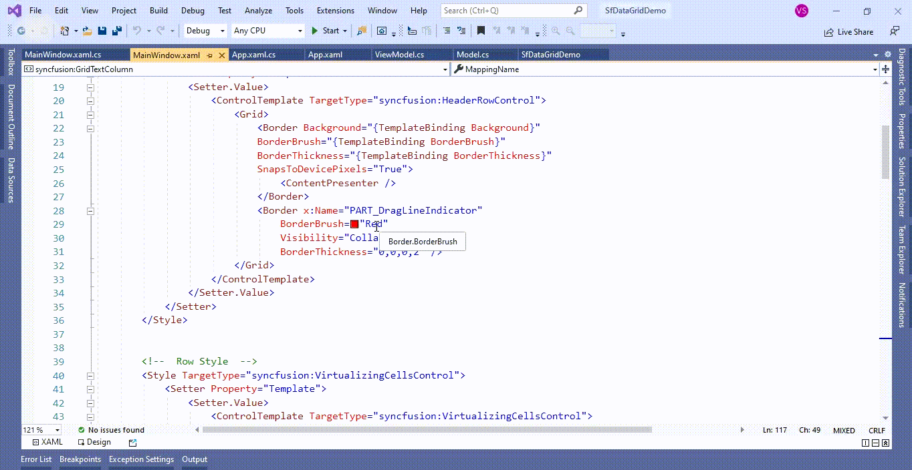
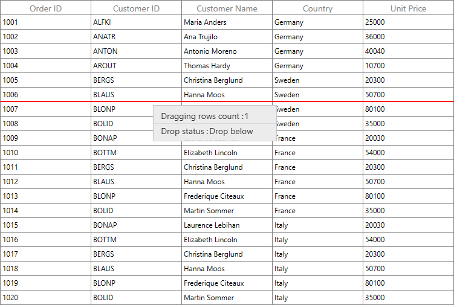

# How to change the color of drag line indicator in WPF DataGrid (SfDataGrid)?

## About the sample
This example illustrates how to change the color of drag line indicator in [WPF DataGrid](https://www.syncfusion.com/wpf-ui-controls/datagrid) (SfDataGrid)?

By default, [WPF DataGrid](https://www.syncfusion.com/wpf-ui-controls/datagrid) (SfDataGrid) does not provide the direct support to change the color of drag line indicator. You can change the color of drag line indicator by overriding the [HeaderRowControl](https://help.syncfusion.com/cr/wpf/Syncfusion.UI.Xaml.Grid.HeaderRowControl.html) and [VirtualizingCellsControl](https://help.syncfusion.com/cr/wpf/Syncfusion.UI.Xaml.Grid.VirtualizingCellsControl.html) Template in [WPF DataGrid](https://www.syncfusion.com/wpf-ui-controls/datagrid) (SfDataGrid).

```XML

<Window.Resources>
        
        <!--  Header Row Style  -->
        <Style    TargetType="syncfusion:HeaderRowControl">            
            <Setter Property="Template">
                <Setter.Value>
                    <ControlTemplate TargetType="syncfusion:HeaderRowControl">
                        <Grid>
                            <Border Background="{TemplateBinding Background}"
                            BorderBrush="{TemplateBinding BorderBrush}"
                            BorderThickness="{TemplateBinding BorderThickness}"
                            SnapsToDevicePixels="True">
                                <ContentPresenter />
                            </Border>
                            <Border x:Name="PART_DragLineIndicator" 
                                BorderBrush="Red" 
                                Visibility="Collapsed" 
                                BorderThickness="0,0,0,2" />
                        </Grid>
                    </ControlTemplate>
                </Setter.Value>
            </Setter>
        </Style>
        

        <!--  Row Style  -->
        <Style TargetType="syncfusion:VirtualizingCellsControl">           
            <Setter Property="Template">
                <Setter.Value>
                    <ControlTemplate TargetType="syncfusion:VirtualizingCellsControl">
                        <Grid>
                            <VisualStateManager.VisualStateGroups>
                                <VisualStateGroup x:Name="BorderStates">
                                    <VisualState x:Name="NormalRow" />
                                    <VisualState x:Name="FrozenRow">
                                        <Storyboard BeginTime="0">
                                            <ThicknessAnimationUsingKeyFrames BeginTime="0"
                                                                          Duration="1"
                                                                          Storyboard.TargetName="PART_RowBorder"
                                                                          Storyboard.TargetProperty="BorderThickness">
                                                <EasingThicknessKeyFrame KeyTime="0" Value="0, 0, 0, 1" />
                                            </ThicknessAnimationUsingKeyFrames>
                                        </Storyboard>
                                    </VisualState>
                                    <VisualState x:Name="FooterRow">
                                        <Storyboard BeginTime="0">
                                            <ThicknessAnimationUsingKeyFrames BeginTime="0"
                                                                          Duration="1"
                                                                          Storyboard.TargetName="PART_RowBorder"
                                                                          Storyboard.TargetProperty="BorderThickness">

                                                <EasingThicknessKeyFrame KeyTime="0" Value="0, 1, 0, 0" />
                                            </ThicknessAnimationUsingKeyFrames>
                                            <ThicknessAnimationUsingKeyFrames BeginTime="0"
                                                                          Duration="1"
                                                                          Storyboard.TargetName="PART_RowBorder"
                                                                          Storyboard.TargetProperty="Margin">
                                                <EasingThicknessKeyFrame KeyTime="0" Value="0, -1, 0, 0" />
                                            </ThicknessAnimationUsingKeyFrames>
                                        </Storyboard>
                                    </VisualState>
                                </VisualStateGroup>
                            </VisualStateManager.VisualStateGroups>
                            <Border x:Name="PART_RowBorder"
                                BorderBrush="{TemplateBinding BorderBrush}"
                                BorderThickness="{TemplateBinding BorderThickness}" />
                            <Rectangle Clip="{TemplateBinding RowBackgroundClip}" Fill="{TemplateBinding Background}" />
                            <Border Background="{TemplateBinding RowSelectionBrush}"
                                Clip="{TemplateBinding SelectionBorderClipRect}"
                                Visibility="{TemplateBinding SelectionBorderVisiblity}" />
                            <Border Background="{TemplateBinding RowHoverBackgroundBrush}"
                                BorderBrush="{TemplateBinding RowHoverBackgroundBrush}"
                                BorderThickness="{TemplateBinding RowHighlightBorderThickness}"
                                Clip="{TemplateBinding HighlightBorderClipRect}"
                                SnapsToDevicePixels="True"
                                Visibility="{TemplateBinding HighlightSelectionBorderVisiblity}" />
                            <Rectangle x:Name="PART_CurrentFocusRow"
                                   Margin="{TemplateBinding CurrentFocusBorderMargin}"
                                   Stroke="#666666"
                                   StrokeDashArray="2,2"
                                   StrokeThickness="1"
                                   Visibility="{TemplateBinding CurrentFocusRowVisibility}" />
                            <Border BorderBrush="{TemplateBinding BorderBrush}" BorderThickness="{TemplateBinding BorderThickness}">
                                <ContentPresenter />
                            </Border>
                            <Border x:Name="PART_DragLineIndicator" 
                                BorderBrush="Red" 
                                Visibility="Collapsed" 
                                BorderThickness="0,0,0,2" />
                        </Grid>
                    </ControlTemplate>
                </Setter.Value>
            </Setter>
        </Style>               
</Window.Resources>

```



The following screenshot shows the drag line indicator color changed,




## Requirements to run the demo
Visual Studio 2015 and above versions


